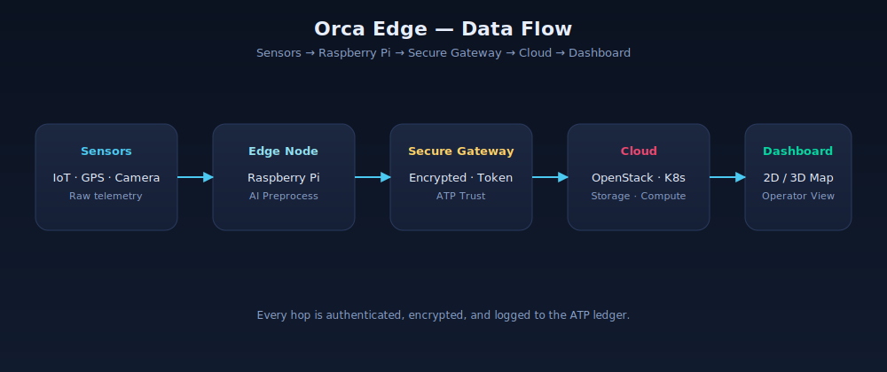
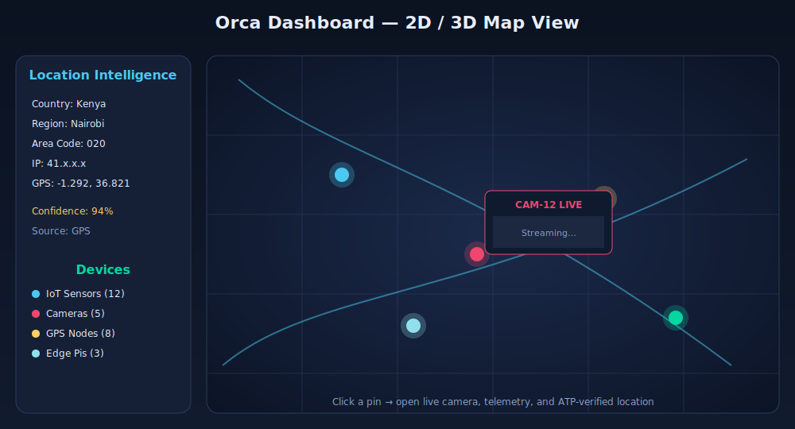

<!--
================================================================================
 SmartCito — Urban Data Backbone for Smart Cities
================================================================================
 File: README.md
 Purpose:
   Top-level entry point for the SmartCito project. This document gives
   contributors, city stakeholders, and researchers a fast, complete overview
   of WHAT the project is, WHY it exists, HOW it is organized, and HOW to
   participate.

 Audience:
   - New developers evaluating the project on GitHub.
   - City IT / innovation teams considering a pilot.
   - Researchers studying smart-city data backbones.

 Conventions:
   - Every file in this repository starts with a documentation header similar
     to this one. Keep that pattern when contributing.
================================================================================
-->

# SmartCito

**Sovereign edge-intelligence platform for cities and infrastructure.**

SmartCito unifies IoT, GPS, cameras, 2D/3D maps, AI, cryptography, and secure edge compute into a single auditable operations dashboard.

The repository now also includes a Kaggle-ready fine-tuning pipeline for `SmartCito-LLaMA3-8B`, a LoRA or QLoRA adaptation of LLaMA-3 for SmartCito operational intelligence.

---

## Operational Overview


End-to-end flow:
**Edge Devices → Edge Compute → Location Fusion + ATP Ledger → Operator Dashboard**

---

## Edge Data Flow



Every hop is authenticated, encrypted, and logged to the ATP ledger.

---

## Location Intelligence (Map Module)

The **Map module** (`/map`) powers SmartCito's sovereign location intelligence: country selection, region/area-code mapping, IP geolocation, GPS validation, and multi-source fusion with confidence scoring.


| Source | Weight | Notes |
| ------ | ------ | ----- |
| GPS | 1.0 | Highest accuracy when available |
| IP Geolocation | 0.6 | ASN + ISP + city |
| Area Code | 0.4 | Country → region → city → coords |
| User Selection | 0.3 | Country / region fallback |


See [`map/README.md`](map/README.md) for full API and usage.

| Service     | URL                        | Purpose                       |
|-------------|----------------------------|-------------------------------|
| Webapp    | http://localhost:5173      | React dashboard               |
| SmartCito API | http://localhost:8000      | FastAPI backend (OpenAPI at `/docs`)  |
| Drone Gateway | http://localhost:8020      | MAVLink / drone telemetry and command gateway |
| Mission Control | http://localhost:8025      | Mission validation, upload, and monitoring |
| Mapping Geospatial | http://localhost:8024   | Drone path, geofence, and overlay service |
| Drone Camera | http://localhost:8022      | RTSP/WebRTC registration and frame metadata |
| Threat Detection | http://localhost:8023    | AI alert correlation surface |
| PostgreSQL  | localhost:5432             | Relational store              |
| Redis       | localhost:6379             | Cache & pub/sub               |
| Kafka       | localhost:9092             | Event streaming               |

### One-Command Full Dashboard Stack

```bash
docker compose up --build
```

That now brings up the main API, web dashboard, drone gateway, mission control,
mapping, drone camera ingestion, threat detection, observability surfaces, and
their local proxy routes in one stack.

### Local SmartCito API Development

```bash
cd citosmart
python -m venv .venv && source .venv/bin/activate
pip install -r requirements.txt
uvicorn app.main:app --reload
```

### Local Webapp Development

```bash
cd webapp
npm install
npm run dev
```

Detailed walkthroughs live in [`docs/`](docs/).

Repository ownership and folder responsibilities are defined in
[`docs/REPOSITORY_STRUCTURE.md`](docs/REPOSITORY_STRUCTURE.md).

For a single wiki-style project entry point, start with [`docs/WIKI.md`](docs/WIKI.md).

For pilot or hardware-backed deployments, see [`docs/DOCKER_DEPLOYMENT.md`](docs/DOCKER_DEPLOYMENT.md)
and [`hardware/`](hardware/).

For the official OpenStack and Kubernetes node image, see [`infra/openstack/smartcito-os/README.md`](infra/openstack/smartcito-os/README.md).


---

## Dashboard — 2D / 3D Map View



The dashboard renders:

- Authenticated device pins (IoT, cameras, GPS, edge Pis)
- Live camera popups linked to GPS coordinates
- Confidence-scored unified location
- 3D operational scene (`webapp/src/components/ThreeDashboardPanel.tsx`)

## Drone and Surveillance Layer

The drone and surveillance layer adds deployable services for drone telemetry,
drone commands, drone camera frame metadata, fixed/mobile sensor readings,
geospatial enrichment, and AI threat detection. These services publish to Kafka,
feed Spark Streaming and storage, and surface drone patrols, sensors, camera
links, heatmaps, and threat zones in the operator dashboard.

The Drone Gateway is the single drone-facing service. It discovers drone
capabilities, syncs the PostgreSQL Drone Registry, streams normalized telemetry,
validates Mission Control commands, and dispatches those commands through
vendor-agnostic adapters.

See [surveillance/README.md](surveillance/README.md) for service APIs,
Kafka topics, Kubernetes deployment, Docker Compose usage, and validation steps.

---

## Repository Layout

| Folder | Purpose |
| ------ | ------- |
| `citosmart/` | Primary FastAPI application, schemas, services, and migrations |
| `ingestion/` | External data ingestion pipelines and connectors |
| `services/` | Deployable microservice workspace for separately scoped services |
| `surveillance/` | Drone gateway, sensor gateway, drone camera ingestion, mapping, and threat services |
| `database/` | Shared database bootstrap and initialization assets |
| `ai_models/` | AI/ML inference services and model packaging |
| `training/` | LoRA and QLoRA training scripts plus dataset preparation tooling |
| `datasets/` | Sample and prepared fine-tuning datasets for SmartCito adapters |
| `examples/` | Kaggle-ready notebooks for training and inference |
| `webapp/` | Primary React frontend for operators |
| `map/` | Location intelligence and mapping subsystem |
| `security/` | Security services, policy, crypto, IAM, and audit assets |
| `infra/` | Kubernetes, Terraform, monitoring, and infrastructure code |
| `hardware/` | Edge hardware integrations and support assets |
| `scripts/` | Development and operational helper scripts |
| `tests/` | Cross-module integration and security tests |
| `docs/` | Architecture, diagrams, runbooks, and reference docs |

Current backend rule: `citosmart/` is the backend API application.
Use `services/` for separately deployable capabilities.

## SmartCito-LLaMA3-8B

The SmartCito AI pipeline fine-tunes `meta-llama/Meta-Llama-3-8B-Instruct` with LoRA or QLoRA and exports adapter-only artifacts to `output/smartcito-lora/`.

- Dataset schema: [training/dataset_format.md](training/dataset_format.md)
- Training scripts: [training/lora_training.py](training/lora_training.py) and [training/qlora_training.py](training/qlora_training.py)
- Evaluation script: [training/evaluate_adapters.py](training/evaluate_adapters.py)
- Kaggle bundle packager: [training/package_kaggle_bundle.py](training/package_kaggle_bundle.py)
- Kaggle publish helper: [training/publish_kaggle_dataset.py](training/publish_kaggle_dataset.py)
- One-command workflow: [Makefile](Makefile)
- Shell workflow wrapper: [scripts/ai.sh](scripts/ai.sh)
- Example notebooks: [examples/smartcito_training_demo.ipynb](examples/smartcito_training_demo.ipynb) and [examples/smartcito_inference_demo.ipynb](examples/smartcito_inference_demo.ipynb)
- Model documentation: [docs/MODEL_CARD.md](docs/MODEL_CARD.md)
- Kaggle workflow: [docs/KAGGLE_GUIDE.md](docs/KAGGLE_GUIDE.md)

Important: the repository does not ship LLaMA-3 base weights. Contributors should only publish LoRA adapters generated from SmartCito training runs.

---

## Releases


- [SmartCito Edge v1.0](docs/SMARTCITO_EDGE_V1_RELEASE.md) — IoT, GPS, Map & Camera Integration

If you find a vulnerability, please **do not open a public issue**. Follow the
disclosure process in [`SECURITY.md`](SECURITY.md).

SmartCito targets compatibility with:

- **GDPR**
- **POPIA**
- **ISO/IEC 27001** practices
- **NIST Cybersecurity Framework** controls


---

## CI/CD

`.env.example` is the single source of truth for local and deployment
configuration. Copy it to `.env` for local development, keep placeholder values
only in version control, and inject the same variables as runtime environment
values in production.

Important environment variables include:

- `DB_HOST`, `DB_PORT`, `DB_USER`, `DB_PASSWORD`, `DB_NAME`
- `KAFKA_BROKER_URL` or `MESSAGE_BUS_URL`
- `OBJECT_STORAGE_ENDPOINT`, `OBJECT_STORAGE_BUCKET`
- `AUTH_JWT_SECRET`, `AUTH_ISSUER`, `AUTH_AUDIENCE`
- `OPENSTACK_AUTH_URL`, `OPENSTACK_PROJECT`, `OPENSTACK_USER`, `OPENSTACK_PASSWORD`

SmartCito now standardizes CI/CD across GitHub Actions and GitLab around these
stages: **build → test → package → deploy-staging → deploy-production**.

- CI builds one Docker image per service tagged with the commit SHA.
- CI runs backend, frontend, and service-specific test suites.
- CD deploys to OpenStack VMs through scripts in `infra/deploy/`.

See [`.github/workflows/ci.yml`](.github/workflows/ci.yml),
[`.github/workflows/full-stack-cicd.yml`](.github/workflows/full-stack-cicd.yml),
[`.gitlab-ci.yml`](.gitlab-ci.yml), and [`infra/deploy/README.md`](infra/deploy/README.md).

---

## Security

- All device communication is encrypted and token-authenticated
- All location events are HMAC-signed into the ATP ledger
- Only authenticated, validated devices appear on the map
- Containers are Debian-based for OpenStack and Kubernetes compatibility
