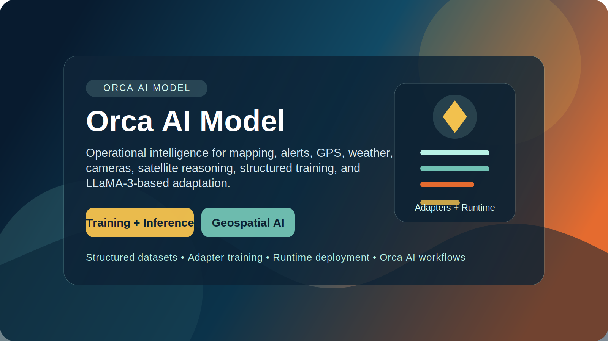

# Orca Model



Orca Model is the AI workspace for Orca operational intelligence. It packages enterprise-ready training, evaluation, inference, and deployment assets for city operations, critical infrastructure monitoring, sensor fusion, camera analytics, robotic workflows, and geospatial decision support.

This `ai/` directory is the canonical AI bundle entry point for Kaggle and internal model operations.

## Visual Assets

This bundle includes Kaggle-ready visuals under `ai/assets/kaggle/`:

- `orca-kaggle-cover.svg` for the main bundle banner
- `orca-data-pipeline.svg` for ingestion and training flow diagrams
- `orca-runtime-map.svg` for runtime, mapping, and operations visuals
- `orca-ai-model-icon.svg` for Orca AI model branding and avatars

## What This Bundle Is

Orca Model is designed for controlled, auditable AI workflows:

- LoRA and QLoRA fine-tuning for Orca task adaptation
- adapter-only output sharing for compliant collaboration
- runtime support for versioned local deployment
- inference services for operational reasoning and alert handling
- training data preparation for structured Orca task records
- Kaggle-ready examples for reproducible experimentation

This bundle does not include LLaMA-3 weights or any other foundation-model weights. It only ships Orca code, LoRA or QLoRA adapters, and synthetic or private datasets. Users must obtain any compatible base model from official provider sources.

## Enterprise Scope

Orca Model is intended for organizations that need:

- auditable AI workflows with clear artifact boundaries
- controlled adapter training instead of raw foundation-model redistribution
- domain-specific reasoning for drones, sensors, cameras, maps, and operator workflows
- versioned deployment artifacts for repeatable runtime promotion
- separation between public examples and private operational data

## Bundle Layout

- `ai/ai_models/` — inference APIs, model utilities, and runtime dependencies
- `ai/model_stack/` — modular TensorFlow model modules for GPS classification, trajectory forecasting, anomaly detection, drone vision, and sensor fusion
- `ai/ingestion/` — external data ingestion for space weather, satellite, GPS, and map sources
- `ai/training/` — dataset preparation, fine-tuning, evaluation, Kaggle packaging, and publishing
- `ai/datasets/` — sample and prepared datasets for Orca AI workflows
- `ai/examples/` — Kaggle-ready notebook and demo assets
- `ai/orca_runtime/` — runtime and model loading logic
- `ai/orca_datasets/` — generated ingestion batches for training flows
- `ai/models/` — versioned Orca runtime model artifacts
- `ai/output/` — LoRA adapter outputs and evaluation reports

## Core Workflows

### 1. Ingest External Data

Pull external operational context into Orca training batches stored under `ai/datasets/`:

```bash
python ai/ingestion/space_weather_ingestor.py
python ai/ingestion/satellite_ingestor.py
python ai/ingestion/gps_ingestor.py --input-file path/to/gps_logs.json
python ai/ingestion/map_ingestor.py --bbox "-26.25,27.98,-26.15,28.08"
```

### 2. Prepare Training Data

Convert Orca task records or normalized source data into supervised training examples:

```bash
python ai/training/prepare_dataset.py \
	--input ai/datasets/sample_training_data.json \
	--output ai/datasets/prepared_orca_training_data.jsonl
```

### 3. Train the Runtime Model

Train the versioned Orca runtime model directly from JSON records in `ai/datasets/`:

```bash
python ai/training/train.py --dataset-dir ai/datasets --models-dir ai/models
```

### 4. Fine-Tune Adapters

Run LoRA or QLoRA against a user-supplied compatible base model:

```bash
python ai/training/lora_training.py \
	--dataset ai/datasets/sample_training_data.json \
	--base-model your-foundation-model-id \
	--output-dir ai/output/orca-lora
```

```bash
python ai/training/qlora_training.py \
	--dataset ai/datasets/sample_training_data.json \
	--base-model your-foundation-model-id \
	--output-dir ai/output/orca-lora
```

### 4b. Train Modular Model Stack

Install the dedicated model stack dependencies when you want TensorFlow-backed sequence and vision models:

```bash
pip install -r ai/model_stack/requirements.txt
```

Train individual modules independently:

```bash
python -m ai.model_stack.models.gps_classification.train \
	--dataset ai/datasets/gps_classification.json \
	--output-dir ai/models/model_stack/gps_classifier_v1
```

```bash
python -m ai.model_stack.models.trajectory_prediction.train \
	--dataset ai/datasets/trajectory_prediction.json \
	--output-dir ai/models/model_stack/trajectory_v1
```

```bash
python -m ai.model_stack.models.drone_vision.train \
	--dataset ai/datasets/drone_vision.json \
	--output-dir ai/models/model_stack/drone_vision_v1
```

The same package also includes anomaly detection, sensor fusion, shared preprocessing, SavedModel export, and a unified pipeline wrapper in `ai/model_stack/pipeline.py`.

### 5. Evaluate Outputs

Score trained adapters and generate review-ready reports:

```bash
python ai/training/evaluate_adapters.py \
	--dataset ai/datasets/sample_evaluation_data.json \
	--base-model your-foundation-model-id \
	--adapter-path ai/output/orca-lora \
	--output ai/output/orca-lora/evaluation_summary.json \
	--markdown-report ai/output/orca-lora/evaluation_report.md
```

### 6. Run Inference

Use the FastAPI inference service for Orca task execution:

```bash
uvicorn ai.ai_models.inference:app --host 0.0.0.0 --port 8012
```

The inference layer supports Orca decision surfaces for mission planning, robot navigation, camera analysis, sensor fusion, threat assessment, geographic reasoning, and infrastructure operations.

### 7. Package for Kaggle

Create a clean Kaggle-ready bundle:

```bash
python ai/training/package_kaggle_bundle.py
```

Publish metadata for Kaggle dataset distribution:

```bash
python ai/training/publish_kaggle_dataset.py --bundle-dir dist/orca_ai_kaggle
```

## Runtime

Orca Model also includes a local runtime for organizations that need versioned, self-managed deployment without bundling foundation-model weights.

- generated training batches land in `ai/orca_datasets/`
- versioned runtime models are stored in `ai/models/orca_model_vN/`
- active deployment state is tracked in `ai/models/active_model.json`
- runtime orchestration is exposed through the root `orca` CLI

Example commands:

```bash
./orca ingest --config ingestion/config/datastream_sources.json
./orca train --batch-dir ai/orca_datasets
./orca deploy --version orca_model_v1
./orca dataset export --batch-dir ai/orca_datasets --output-path exports/orca_external.json
```

## Kaggle Assets

This bundle includes the primary public AI deliverables:

- `ai/examples/Orca_Training_Demo.ipynb`
- `ai/examples/orca_inference_demo.ipynb`
- `ai/examples/inference_demo.py`

These assets are intended to demonstrate the Orca Model workflow without exposing regulated data, secrets, or foundation-model weights.

## Compliance Boundary

Orca Model should be shared with the following controls:

- publish adapters, not base weights
- publish synthetic or sanitized private data only
- exclude secrets, tokens, and private credentials
- exclude proprietary raw logs unless explicitly approved for internal use
- preserve evaluation outputs and artifact lineage for review

## Recommended Entry Points

- Dataset schema: `ai/training/dataset_format.md`
- Model stack: `ai/model_stack/README.md`
- Model card: `docs/MODEL_CARD.md`
- Operational flow: `docs/OPERATIONAL_FLOW.md`
- Kaggle workflow: `docs/KAGGLE_USAGE.md`
- Runtime flow: `docs/ORCA_MODEL_RUNTIME.md`

## Operational Standard

For enterprise use, treat `ai/` as the single source of truth for Orca AI assets. New training scripts, evaluation logic, datasets, notebooks, runtime code, and adapter artifacts should live under this directory so packaging, validation, and distribution remain auditable and repeatable.
