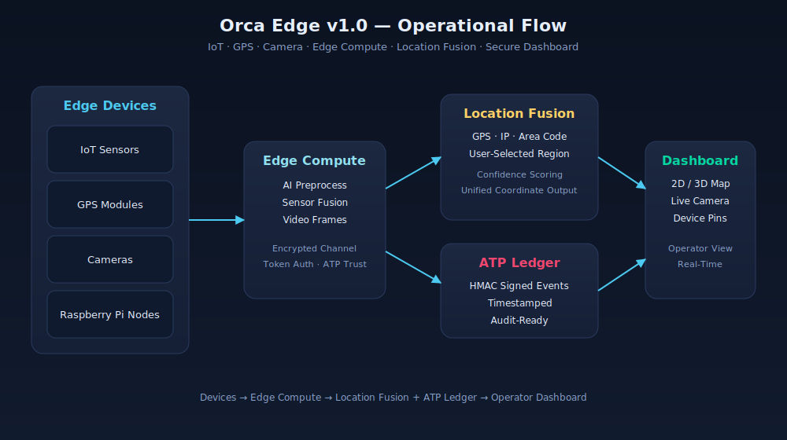

# Orca Edge v1.0

## IoT, GPS, Map & Camera Integration

Orca Edge v1.0 introduces the first unified integration of IoT devices, GPS modules, 2D/3D map rendering, and camera systems into a secure edge-computing framework.

This release establishes the foundation for Orca’s real-time city-intelligence platform by enabling devices to register, authenticate, stream data, and visualize activity from a single dashboard.

---

## Release Highlights

### IoT Device Integration

- Automatic device registration
- Health monitoring
- Secure sensor data ingestion
- Raspberry Pi, USB hardware, and edge-node support

### GPS Location Engine

- Real-time geolocation tagging
- Location tracking for connected devices
- Map-based device visualization

### 2D/3D Map Rendering

- WebGL-powered map support
- Device position rendering
- Movement path visualization
- Event overlays for alerts and incidents

### Camera Streaming Integration

- Live camera feed support
- Camera streams linked to GPS coordinates
- Clickable map pins for direct video access

### Edge Compute Pipeline

- Raspberry Pi and edge-node preprocessing
- Local AI, sensor, and video processing
- Reduced cloud load and faster response time

### Security & Cryptography Layer

- Encrypted device communication
- Token-based authentication
- ATP trust scoring
- Secure data exchange between edge and cloud systems

### Unified Dashboard View

- IoT, GPS, map, and camera modules in one interface
- Real-time operational visibility
- Centralized monitoring for city infrastructure

### Location Intelligence Module

- ISO-3166 country selection
- Region / state / province lookup per country
- Area code → city → coordinates mapping
- IPv4 + IPv6 geolocation with ASN/ISP lookup
- GPS reader with accuracy validation
- Multi-source Location Fusion Engine
- Confidence scoring per source (GPS, IP, area code, user-selected)
- ATP-signed location event logging
- REST API for dashboard integration
- React dashboard panel with country/region dropdowns, GPS capture, IP lookup, and fused result

---

## Why This Release Matters

Orca Edge v1.0 marks the beginning of Orca’s edge-intelligence architecture.

It enables cities, operators, and organizations to monitor physical environments in real time, connect field devices securely, and visualize critical infrastructure activity from one unified platform.

---

## Expected Outcome

With this release, Orca can:

- Register and monitor edge devices
- Track device locations in real time
- Display devices on 2D and 3D maps
- Link camera feeds to map coordinates
- Process data at the edge before cloud upload
- Secure communications with cryptography and trust scoring
- Provide a unified dashboard for operators
- Fuse GPS, IP, area code, and user-selected inputs into one verified location
- Render only authenticated, validated devices on the map
- Log every location event into the ATP ledger with HMAC signatures

---

## Location Intelligence API

| Method | Path | Purpose |
| ------ | ---- | ------- |
| GET | `/api/location/countries` | List ISO-3166 countries |
| GET | `/api/location/regions/:iso2` | Regions for a country |
| GET | `/api/location/area-codes/:iso2` | Area codes for a country |
| GET | `/api/location/ip/:ip` | IP geolocation lookup |
| POST | `/api/location/fuse` | Fuse GPS + IP + area code + user-selected |
| POST | `/api/location/log` | Append signed location event to ATP ledger |

### Source Priority

1. GPS (highest)
2. IP geolocation
3. Area-code resolution
4. User-selected country/region (lowest)

---

## Release Status

**Version:** Orca Edge v1.0  
**Focus:** IoT, GPS, Map, Camera, Edge Compute, Security, Location Intelligence  
**Target Users:** Developers, operators, infrastructure teams, and city-intelligence administrators

## Visualizing Orca in Action

### Architecture Diagram



The diagram above shows the end-to-end flow:

**Edge Devices → Edge Compute → Location Fusion + ATP Ledger → Operator Dashboard**

### 3D Operational Scene

A live Three.js scene now lives in the main frontend at
`webapp/src/components/ThreeDashboardPanel.tsx` and renders:

- A city ground plane with grid overlay
- Glowing device pins (IoT, GPS, camera, edge nodes)
- A central dashboard hub
- Animated data packets flowing from each device to the hub along curved arcs

Use it in the webapp dashboard:

```tsx
import ThreeDashboardPanel from "@/components/ThreeDashboardPanel";

<ThreeDashboardPanel scene={sceneOverview} />
```
