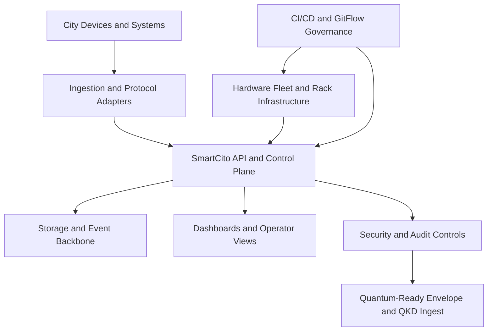
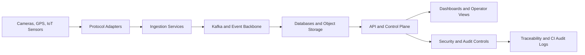
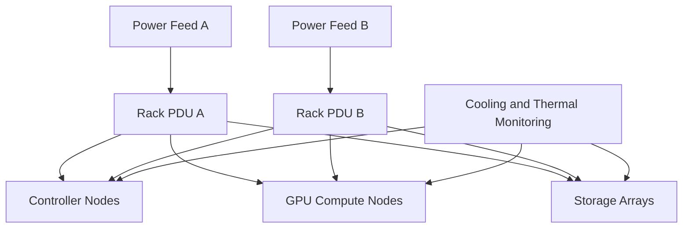
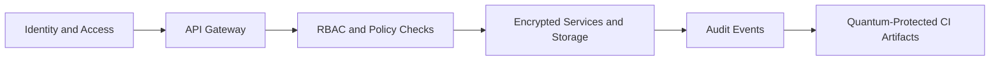
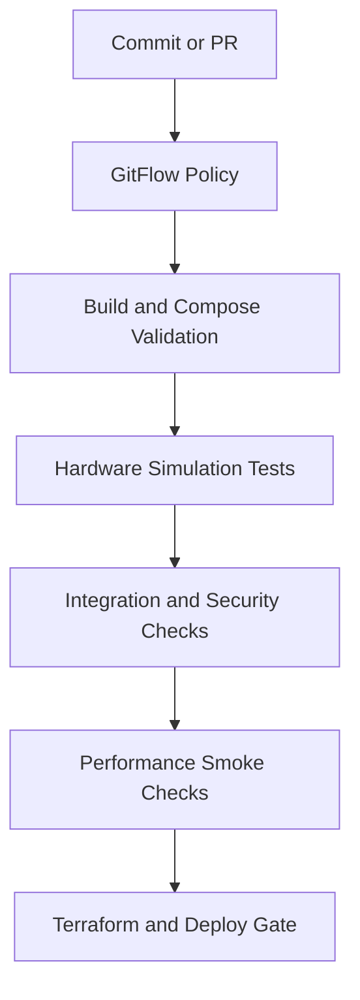

<!--
================================================================================
 File: docs/WIKI.md
 Purpose:
   Wiki-style home page for the SmartCito repository. This page gives readers
   one navigable starting point for the platform's purpose, architecture,
   deployment model, hardware story, security posture, and contributor flows.
================================================================================
-->

# SmartCito Wiki

> A single entry point for understanding SmartCito as a platform, a codebase,
> a hardware-aware deployment model, and a contributor ecosystem.

For a GitHub Wiki-ready version of this documentation set, start with
[wiki/Home.md](wiki/Home.md).

SmartCito aims to become a secure urban operations backbone that connects city
devices, edge systems, analytics, storage, dashboards, and governance into one
auditable and scalable platform. This wiki is the visual encyclopedia of that
goal: what each module does, why it exists, how it connects to the rest of the
system, and what security controls protect it.

---

## What SmartCito Is

SmartCito is an urban data backbone designed to unify software services,
hardware integrations, security controls, and operational workflows into one
 platform for smart-city deployments.

At its core, SmartCito brings together:

- real-time ingestion for sensors, cameras, and GPS devices,
- secure APIs and RBAC-governed services,
- operator dashboards and analytics surfaces,
- hardware-aware deployment patterns,
- quantum-ready security abstractions,
- automated CI/CD and GitFlow-based governance.

If you are new to the project, this page is the fastest way to understand what
exists, how the parts fit together, and where to go next.

---

## Start Here

| Goal | Read This First | Then Continue With |
|---|---|---|
| Understand the platform at a glance | [README.md](../README.md) | [ARCHITECTURE.md](ARCHITECTURE.md) |
| Explore the HTTP surface | [API.md](API.md) | `citosmart/app/api/v1/` |
| Run locally with containers | [DOCKER_DEPLOYMENT.md](DOCKER_DEPLOYMENT.md) | [../docker-compose.yml](../docker-compose.yml) |
| Understand security posture | [SECURITY_DEEP_DIVE.md](SECURITY_DEEP_DIVE.md) | [../security/README.md](../security/README.md) |
| Follow the contribution model | [../CONTRIBUTING.md](../CONTRIBUTING.md) | [GITFLOW.md](GITFLOW.md) |
| Understand hardware validation | [../hardware/README.md](../hardware/README.md) | `hardware/*/test_*.py` |

---

## Wiki Index

Each major capability area now has its own dedicated wiki page.

| Wiki Page | Focus |
|---|---|
| [wiki/CI_CD_AND_GITFLOW_GOVERNANCE.md](wiki/CI_CD_AND_GITFLOW_GOVERNANCE.md) | Branching, approvals, pipelines, release flow |
| [wiki/HARDWARE_FLEET_AND_RACK_INFRASTRUCTURE.md](wiki/HARDWARE_FLEET_AND_RACK_INFRASTRUCTURE.md) | Rack layout, power, cooling, hardware validation |
| [wiki/SMARTEDGE_API_AND_CONTROL_PLANE.md](wiki/SMARTEDGE_API_AND_CONTROL_PLANE.md) | API gateway, orchestration, endpoints, control-plane behavior |
| [wiki/SECURITY_AND_AUDIT_CONTROLS.md](wiki/SECURITY_AND_AUDIT_CONTROLS.md) | Encryption, IAM, audit, compliance, quantum-safe posture |
| [wiki/DASHBOARDS_AND_OPERATOR_VIEWS.md](wiki/DASHBOARDS_AND_OPERATOR_VIEWS.md) | Operator UX, panels, observability, dashboard intent |
| [wiki/STORAGE_AND_EVENT_BACKBONE.md](wiki/STORAGE_AND_EVENT_BACKBONE.md) | PostgreSQL, Kafka, object and block storage, event flow |
| [wiki/INGESTION_AND_PROTOCOL_ADAPTERS.md](wiki/INGESTION_AND_PROTOCOL_ADAPTERS.md) | MQTT, RTSP, ONVIF, GPS, adapters, protocol normalization |
| [wiki/CITY_DEVICES_AND_SYSTEMS.md](wiki/CITY_DEVICES_AND_SYSTEMS.md) | Cameras, GPS, IoT sensors, field integration |
| [wiki/QUANTUM_SAFE_ENVELOPE_AND_OID_WRAPPERS.md](wiki/QUANTUM_SAFE_ENVELOPE_AND_OID_WRAPPERS.md) | PQC, QKD, hybrid envelope, future crypto migration |
| [wiki/ROADMAP_AND_DELIVERY_TIMELINE.md](wiki/ROADMAP_AND_DELIVERY_TIMELINE.md) | Short-, mid-, and long-term platform goals |

---

## Platform Map



SmartCito is not only an API and web dashboard. It is a full deployment model
that spans application code, containers, infrastructure automation, hardware
validation, and security controls.

### What We Are Trying To Achieve

SmartCito is meant to evolve into a platform where:

- city devices can be onboarded through open protocols rather than vendor lock-in,
- operational teams can see events, telemetry, and risk in near real time,
- security and audit controls are embedded in every service boundary,
- infrastructure and hardware are validated alongside application code,
- quantum-safe migration can happen without redesigning the entire stack.

---

## Repository Guide

### Core Application

- [../citosmart](../citosmart)
Purpose:
The FastAPI backend, domain services, schemas, database models, auth logic,
camera registry, ingestion services, and quantum-ready APIs.

### Web Experience

- [../webapp](../webapp)
Purpose:
The React and Vite dashboard for operators, analysts, and demo flows.

### Domain Services

- [../camera_module](../camera_module)
- [../gps_module](../gps_module)
- [../ai_models](../ai_models)
- [../security](../security)
- [../hardware](../hardware)
- [../database](../database)
- [../ingestion](../ingestion)

Purpose:
These folders hold the split domain implementations, Docker surfaces, and
living documentation for major SmartCito functions.

### Infrastructure and Delivery

- [../infra](../infra)
- [../services](../services)

Purpose:
Kubernetes manifests, Terraform, Puppet, service containers, and deployment
support assets for local, pilot, and production-like environments.

---

## Runtime Topology

### Local Development Stack

The default local stack is defined in [../docker-compose.yml](../docker-compose.yml).
It includes the API, webapp, database, Redis, Kafka, MQTT, and Dash analytics.

Use this when you want:

- a developer-friendly local environment,
- software-only integration testing,
- UI and API iteration without hardware dependencies.

### Hardware-Aware Overlay

The hardware-oriented compose overlay lives in
[../docker-compose.hardware.yml](../docker-compose.hardware.yml).

Use this when you want:

- stricter runtime isolation,
- monitoring network segmentation,
- resource reservations closer to pilot deployments,
- hardware-adjacent validation flows.

### Split-Service Stack

The split-service compose surface lives in
[../docker-compose.services.yml](../docker-compose.services.yml).

Use this when you want:

- function-by-function container testing,
- independent service validation,
- service-oriented deployment rehearsals.

### End-to-End Data and Operator Flow



---

## Hardware Story

SmartCito treats hardware as a first-class concern, not as an afterthought.

The hardware tree covers:

- compute profiles for controller and GPU nodes,
- storage tiers and durability patterns,
- network segmentation and transport baselines,
- rack layout, power, and UPS redundancy,
- security appliances and HSM controls,
- camera and GPS integration guidance.

The repo now also includes hardware CI scripts for:

- [../hardware/compute/test_compute_nodes.py](../hardware/compute/test_compute_nodes.py)
- [../hardware/storage/test_storage_arrays.py](../hardware/storage/test_storage_arrays.py)
- [../hardware/networking/test_network_transmission.py](../hardware/networking/test_network_transmission.py)
- [../hardware/security/test_hsm_integrity.py](../hardware/security/test_hsm_integrity.py)
- [../hardware/racks/test_power_distribution.py](../hardware/racks/test_power_distribution.py)

These tests provide a simulation-first validation model in CI and can be aimed
at live endpoints when hardware-backed environments are available.

### Rack, Power, and Cooling Intent



---

## Security and Quantum Readiness

SmartCito’s security model spans both software and infrastructure.

Current controls include:

- JWT and RBAC enforcement,
- AES-256-GCM encryption helpers,
- audit logging,
- security policy and compliance documents,
- hardware HSM validation surfaces,
- quantum-ready hybrid envelope support,
- QKD key ingestion APIs for future integrations.

Key entry points:

- [SECURITY_DEEP_DIVE.md](SECURITY_DEEP_DIVE.md)
- [../security/README.md](../security/README.md)
- [../citosmart/app/services/quantum_security.py](../citosmart/app/services/quantum_security.py)
- [../citosmart/app/api/v1/endpoints/quantum.py](../citosmart/app/api/v1/endpoints/quantum.py)

CI audit artifacts can also be wrapped in a quantum-ready envelope using
[../scripts/ci/quantum_protect_audit.py](../scripts/ci/quantum_protect_audit.py).

### Security Layer View



---

## CI/CD and Quality Gates

SmartCito now uses multiple repository workflows to protect changes:

- [../.github/workflows/ci.yml](../.github/workflows/ci.yml)
Purpose:
Application quality checks for backend and webapp.

- [../.github/workflows/security.yml](../.github/workflows/security.yml)
Purpose:
Security scanning, secret detection, and manifest or container validation.

- [../.github/workflows/gitflow.yml](../.github/workflows/gitflow.yml)
Purpose:
Branch policy enforcement for the GitFlow operating model.

- [../.github/workflows/full-stack-cicd.yml](../.github/workflows/full-stack-cicd.yml)
Purpose:
Full-stack validation for traceability, containers, hardware simulation,
integration checks, security posture, performance smoke checks, and deploy
gates.

Traceability artifacts live under:

- [../logs/README.md](../logs/README.md)
- [../scripts/ci/record_ci_audit.py](../scripts/ci/record_ci_audit.py)

### Full Validation Flow



---

## GitFlow in Practice

SmartCito uses GitFlow to keep active work stable and reviewable.

| Branch Type | Source | Merge Target | Use |
|---|---|---|---|
| `feature/*` | `develop` | `develop` | New work in one module or service |
| `release/*` | `develop` | `main` and `develop` | Release preparation |
| `hotfix/*` | `main` | `main` and `develop` | Urgent production corrections |

Read the operating guide here:

- [GITFLOW.md](GITFLOW.md)
- [../CONTRIBUTING.md](../CONTRIBUTING.md)

---

## Recommended Reading Paths

### For Developers

1. [README.md](../README.md)
2. [ARCHITECTURE.md](ARCHITECTURE.md)
3. [API.md](API.md)
4. [../CONTRIBUTING.md](../CONTRIBUTING.md)
5. [GITFLOW.md](GITFLOW.md)

### For Operators and Platform Engineers

1. [DOCKER_DEPLOYMENT.md](DOCKER_DEPLOYMENT.md)
2. [../infra/kubernetes/README.md](../infra/kubernetes/README.md)
3. [../infra/terraform/README.md](../infra/terraform/README.md)
4. [../hardware/README.md](../hardware/README.md)

### For Security Reviewers

1. [SECURITY_DEEP_DIVE.md](SECURITY_DEEP_DIVE.md)
2. [../SECURITY.md](../SECURITY.md)
3. [../security/README.md](../security/README.md)
4. [../citosmart/app/services/quantum_security.py](../citosmart/app/services/quantum_security.py)

### For Evaluators and Stakeholders

1. [README.md](../README.md)
2. [ROADMAP.md](ROADMAP.md)
3. [ARCHITECTURE.md](ARCHITECTURE.md)
4. [../hardware/README.md](../hardware/README.md)

### For Designers and Documentation Contributors

1. [wiki/DASHBOARDS_AND_OPERATOR_VIEWS.md](wiki/DASHBOARDS_AND_OPERATOR_VIEWS.md)
2. [wiki/HARDWARE_FLEET_AND_RACK_INFRASTRUCTURE.md](wiki/HARDWARE_FLEET_AND_RACK_INFRASTRUCTURE.md)
3. [wiki/ROADMAP_AND_DELIVERY_TIMELINE.md](wiki/ROADMAP_AND_DELIVERY_TIMELINE.md)

---

## Quick Commands

### Run the Main Stack

```bash
cp .env.example .env
docker compose up --build
```

### Validate Split Services

```bash
docker compose -f docker-compose.services.yml config
```

### Run Hardware Simulation Tests

```bash
pytest \
  hardware/compute/test_compute_nodes.py \
  hardware/storage/test_storage_arrays.py \
  hardware/networking/test_network_transmission.py \
  hardware/security/test_hsm_integrity.py \
  hardware/racks/test_power_distribution.py -q
```

### Generate a CI Audit Record

```bash
python3 scripts/ci/record_ci_audit.py local-run
python3 scripts/ci/quantum_protect_audit.py logs/ci_audit.json logs/ci_audit.local.quantum.json
```

---

## Why This Wiki Exists

The repository already contains architecture, API, deployment, security, and
workflow documents. This page exists to make them usable as one coherent system.

Use this page as the project home when you want:

- a guided entry point,
- a review checklist for what SmartCito already covers,
- a clean map for contributors and maintainers,
- a single page you can share with new team members.

---

## Contributor Roles In Wiki Development

SmartCito’s wiki is intended to be maintained collaboratively.

| Role | Expected Contribution |
|---|---|
| Developers | Technical behavior, APIs, code links, container instructions |
| Designers | Architecture visuals, dashboard flows, clearer system storytelling |
| Cloud Engineers | Terraform, Puppet, Kubernetes, deployment and runtime guidance |
| Security Engineers | IAM, encryption, compliance, audit and quantum-safe migration |

Each page should answer four questions clearly:

1. What does this module do?
2. Why is it important?
3. How does it connect to other modules?
4. What security measures are applied?