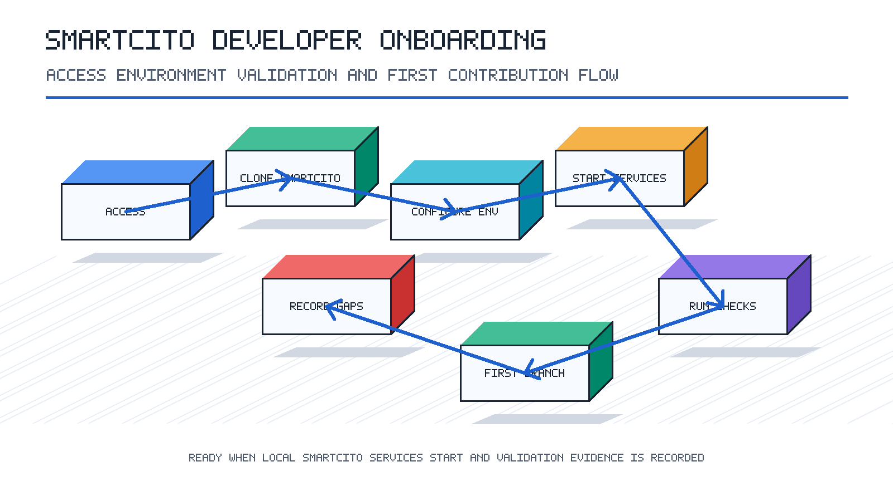

<!--
================================================================================
 File: docs/processes/01-project-onboarding/PROCEDURE.md
 Purpose:
  New developer onboarding procedure for the Smartcito project.
================================================================================
-->

# Project Onboarding Procedure

## Purpose

Guide a new developer from first access through a verified local setup and a
ready first contribution.

## Scope

This procedure covers repository access, documentation orientation, local tool
setup, environment verification, and first-task readiness.

## Owners

- Engineering lead: approves access and first work area.
- Security owner: approves required credentials and permissions.
- New developer: completes setup and records blockers.

## Prerequisites

- Repository access to the SmartCito codebase.
- Git, Docker, Python, Node.js, and npm available locally.
- Approved access to any required issue tracker, container registry, secrets
  manager, or deployment environment.

## Procedure

1. Confirm the developer has access to the repository, issue tracker, and team
   communication channels.
2. Read the project entry points: [../../README.md](../../README.md),
   [../../docs/WIKI.md](../../WIKI.md), and [../../CONTRIBUTING.md](../../../CONTRIBUTING.md).
3. Clone the repository and check out the active development branch.
4. Review the module layout and identify the primary work area.
5. Configure local environment variables using the approved team source.
6. Install backend, frontend, and service dependencies for the target work area.
7. Start the relevant local services and verify that the webapp and API are
   reachable.
8. Run the focused validation command for the first task.
9. Create a small onboarding issue or first contribution branch.
10. Record any missing access, unclear steps, or failed checks in the team
    tracking system.

## Validation Checklist

- Repository clone is complete.
- Developer can create a branch from the active development branch.
- Local application or target service starts successfully.
- At least one focused test or build command has been run.
- Required access gaps have been documented.

## Evidence

- Link to first branch or onboarding issue.
- Notes for any setup failures and their resolution.
- Confirmation from the engineering lead that the developer is ready for a
  scoped first task.

## Related Documentation

- [../../README.md](../../README.md)
- [../../CONTRIBUTING.md](../../../CONTRIBUTING.md)
- [../02-local-development/PROCEDURE.md](../02-local-development/PROCEDURE.md)
