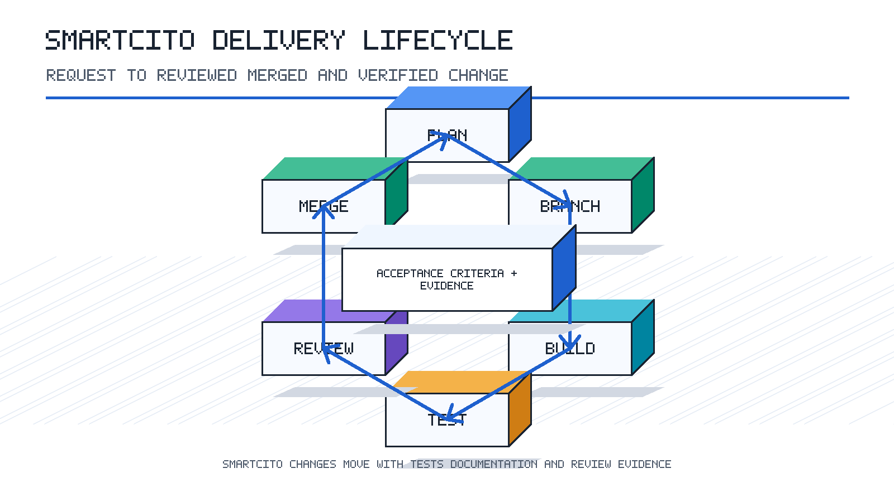

<!--
================================================================================
 File: docs/processes/03-feature-delivery/PROCEDURE.md
 Purpose:
   Feature planning, implementation, review, and merge workflow for SmartCito.
================================================================================
-->

# Feature Delivery Procedure

## Purpose

Describe how a feature moves from request to merged, validated code.

## Scope

This procedure applies to application features, service changes, UI work,
infrastructure changes, and documentation changes that require review.

## Procedure

1. Confirm the feature goal, user value, and acceptance criteria.
2. Identify the owning module and related documentation.
3. Create a branch from the active development branch using the project naming
   convention.
4. Make focused changes that match the existing module style.
5. Update tests and documentation when behavior, setup, or user workflow changes.
6. Run focused validation first, then broader validation when the change touches
   shared contracts or deployment behavior.
7. Open a pull request with a concise summary, test evidence, screenshots or PNG
   visuals when relevant, and known limitations.
8. Address review feedback without rewriting unrelated history.
9. Confirm CI checks and required approvals are complete.
10. Merge according to the active GitFlow and release policy.

## Validation Checklist

- Acceptance criteria are traceable to code, tests, or documentation.
- Tests cover changed behavior at the right level.
- API, schema, UI, and deployment documentation are updated when needed.
- Pull request includes validation evidence.

## Related Documentation

- [../../GITFLOW.md](../../GITFLOW.md)
- [../04-testing-and-quality/PROCEDURE.md](../04-testing-and-quality/PROCEDURE.md)
- [../05-release-management/PROCEDURE.md](../05-release-management/PROCEDURE.md)
