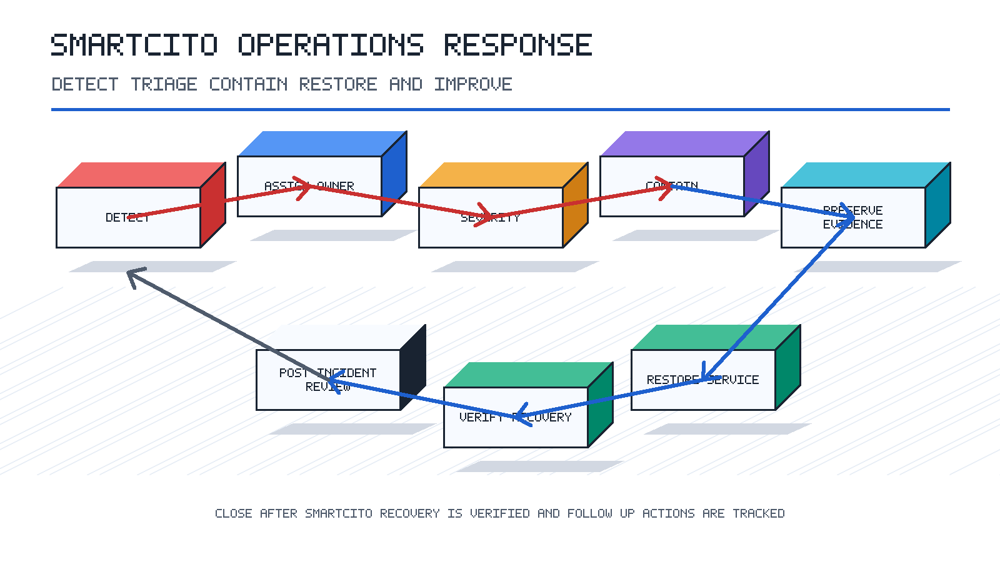

<!--
================================================================================
 File: docs/processes/08-incident-response/PROCEDURE.md
 Purpose:
   Incident response procedure for SmartCito operations.
================================================================================
-->

# Incident Response Procedure

## Purpose

Provide a repeatable path for detecting, triaging, containing, resolving, and
reviewing incidents.

## Scope

This procedure applies to service outages, data ingestion failures, security
events, deployment regressions, infrastructure failures, and hardware field
issues.

## Procedure

1. Detect and record the incident source, timestamp, affected systems, and first
   observable symptoms.
2. Assign an incident owner and communication lead.
3. Classify severity based on customer impact, safety impact, data integrity,
   security exposure, and operational urgency.
4. Contain the incident using the least disruptive approved action.
5. Preserve logs, metrics, screenshots, and other evidence before destructive
   remediation.
6. Restore service through rollback, configuration correction, failover, or
   targeted fix.
7. Verify recovery with health checks and user-facing workflow checks.
8. Communicate status updates until the incident is closed.
9. Complete a post-incident review with root cause, timeline, corrective actions,
   and documentation updates.

## Validation Checklist

- Incident owner is assigned.
- Severity and affected systems are documented.
- Evidence is preserved.
- Recovery is verified.
- Follow-up actions are tracked.

## Related Documentation

- [../../../security/incident_response](../../../security/incident_response)
- [../06-deployment-operations/PROCEDURE.md](../06-deployment-operations/PROCEDURE.md)
- [../07-security-and-compliance/PROCEDURE.md](../07-security-and-compliance/PROCEDURE.md)
