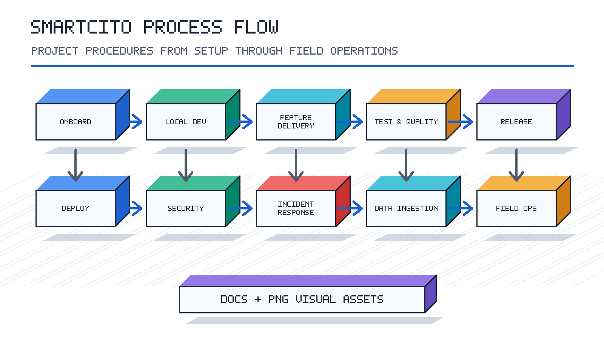

<!--
================================================================================
 File: docs/processes/README.md
 Purpose:
  Process documentation hub for the Smartcito project. This folder
   stores procedures, workflows, operational steps, and documentation visuals
   used by new developers and project operators.
================================================================================
-->

# Smartcito Process Documentation

This folder is the dedicated home for Smartcito procedures,
workflows, operating steps, and process visuals. It is organized so new
developers can move from onboarding to delivery, testing, release, deployment,
security, incident response, data operations, hardware operations, and
documentation maintenance without guessing where a process belongs.

## How To Use This Folder

1. Start with the process area that matches your task.
2. Read the local `PROCEDURE.md` before changing code, infrastructure, data,
   security controls, or documentation assets.
3. Add detailed procedures inside the relevant subfolder as the process matures.
4. Store documentation images as PNG files under `assets/png/`.
5. Register every visual in [assets/PNG_ASSET_MANIFEST.md](assets/PNG_ASSET_MANIFEST.md).

## Process Index

| Area | Procedure | Purpose |
|---|---|---|
| Project onboarding | [01-project-onboarding/PROCEDURE.md](01-project-onboarding/PROCEDURE.md) | Account, repository, environment, and first-task setup |
| Local development | [02-local-development/PROCEDURE.md](02-local-development/PROCEDURE.md) | Running the application and supporting services locally |
| Feature delivery | [03-feature-delivery/PROCEDURE.md](03-feature-delivery/PROCEDURE.md) | Planning, coding, review, and merge workflow |
| Testing and quality | [04-testing-and-quality/PROCEDURE.md](04-testing-and-quality/PROCEDURE.md) | Test selection, validation, and acceptance checks |
| Release management | [05-release-management/PROCEDURE.md](05-release-management/PROCEDURE.md) | Versioning, release readiness, and release notes |
| Deployment operations | [06-deployment-operations/PROCEDURE.md](06-deployment-operations/PROCEDURE.md) | Container, service, and infrastructure deployment steps |
| Security and compliance | [07-security-and-compliance/PROCEDURE.md](07-security-and-compliance/PROCEDURE.md) | Security review, access control, audit, and compliance evidence |
| Incident response | [08-incident-response/PROCEDURE.md](08-incident-response/PROCEDURE.md) | Triage, containment, recovery, and post-incident review |
| Data and ingestion operations | [09-data-and-ingestion-operations/PROCEDURE.md](09-data-and-ingestion-operations/PROCEDURE.md) | Device, stream, schema, and storage operations |
| Hardware and field operations | [10-hardware-and-field-operations/PROCEDURE.md](10-hardware-and-field-operations/PROCEDURE.md) | Edge hardware, camera, GPS, rack, and pilot validation |
| Documentation and visual assets | [11-documentation-and-visual-assets/PROCEDURE.md](11-documentation-and-visual-assets/PROCEDURE.md) | Writing standards, review flow, and PNG asset requirements |

## Required PNG Visuals

Initial PNG visuals have been prepared in [assets/png/](assets/png/):

- `smartcito-process-map.png`
- `developer-onboarding-flow.png`
- `delivery-lifecycle.png`
- `operations-response-flow.png`

Future procedure-specific screenshots, diagrams, runbook flows, and UI captures
must also be saved as PNG files in the same asset folder unless a subfolder has
a more specific asset policy.

## Procedure Standard

Each major process should include:

- purpose and scope,
- owner and participants,
- prerequisites,
- step-by-step procedure,
- validation checklist,
- required evidence or artifacts,
- escalation path,
- related documentation links,
- related PNG visual references.

Use the existing procedures as the baseline format when adding new operational
content.
