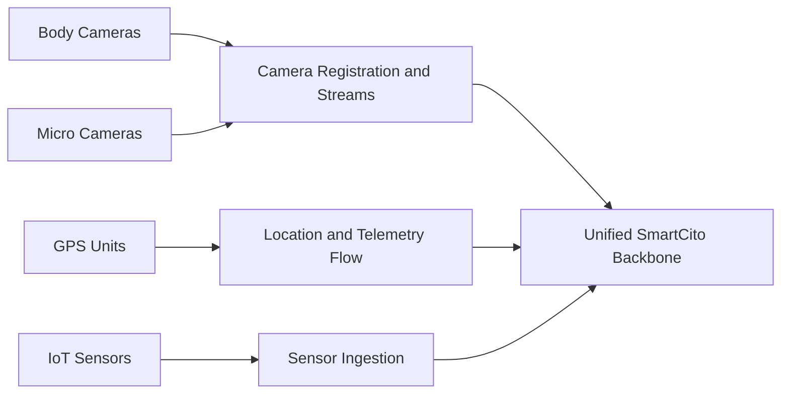

<!--
================================================================================
 File: docs/wiki/CITY_DEVICES_AND_SYSTEMS.md
 Purpose:
   Dedicated wiki page for field devices, edge systems, and how SmartCito
   connects cameras, GPS units, and sensors into the platform.
================================================================================
-->

# City Devices and Systems

<p align="center">
  
</p>

## What This Module Does

This area describes the real-world field inputs that SmartCito expects:
cameras, GPS trackers, IoT sensors, and other city-connected systems.

## Why It Is Important

SmartCito exists to unify fragmented urban telemetry. The device layer is the
source of truth for everything the platform tries to observe and act on.

## How It Connects To Other Modules

- field devices feed protocol adapters,
- adapters feed ingestion,
- ingestion updates storage and dashboards,
- security governs identity, access, and traceability.

## Security Measures Applied

- controlled device registration,
- secure transport and metadata handling,
- audit-linked hardware events,
- tamper-aware security expectations for camera hardware.

## Connection View



## Related Surfaces

- [../../hardware/README.md](../../hardware/README.md)
- [../../hardware/body_cameras](../../hardware/body_cameras)
- [../../hardware/micro_cameras](../../hardware/micro_cameras)
- [../../hardware/gps_modules](../../hardware/gps_modules)
- [../../citosmart/app/api/v1/endpoints/cameras.py](../../citosmart/app/api/v1/endpoints/cameras.py)

## Container Run Instructions

```bash
docker compose up --build camera-service gps-service citosmart
```