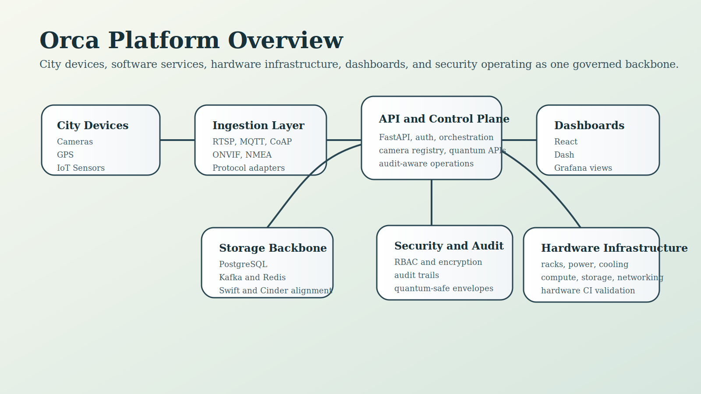
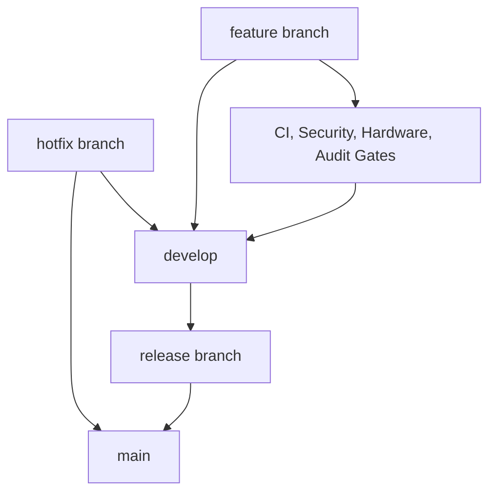

<!--
================================================================================
 File: docs/wiki/CI_CD_AND_GITFLOW_GOVERNANCE.md
 Purpose:
   Dedicated wiki page for SmartCito's branching model, approvals, CI/CD
   pipeline structure, and repository governance.
================================================================================
-->

# CI/CD and GitFlow Governance

<p align="center">
  
</p>

## What This Module Does

This area defines how SmartCito changes move from local development to reviewed
integration, security validation, and deploy-ready states.

## Why It Is Important

Without governance, SmartCito would accumulate unstable code, weak reviews,
untracked changes, and inconsistent deployment behavior across software and
hardware domains.

## How It Connects To Other Modules

- gates backend and webapp quality,
- validates hardware CI flows,
- protects security and infrastructure changes,
- controls when deploy automation is allowed to run.

## Security Measures Applied

- branch policy enforcement,
- approval requirements,
- CI gate requirements,
- security-signoff checks,
- traceability logging for pipeline runs.

## Visual Flow



## Code and Workflow Surfaces

- [../../.github/workflows/gitflow.yml](../../.github/workflows/gitflow.yml)
- [../../.github/workflows/ci.yml](../../.github/workflows/ci.yml)
- [../../.github/workflows/security.yml](../../.github/workflows/security.yml)
- [../../.github/workflows/full-stack-cicd.yml](../../.github/workflows/full-stack-cicd.yml)
- [../GITFLOW.md](../GITFLOW.md)
- [../../CONTRIBUTING.md](../../CONTRIBUTING.md)

## Container and Validation Commands

```bash
docker compose -f docker-compose.yml config
docker compose -f docker-compose.yml -f docker-compose.hardware.yml config
docker compose -f docker-compose.services.yml config
```

## Approval Model

- GitFlow controls branch targets.
- CI must pass before merge.
- Security checks and audit capture are mandatory.
- `main` is reserved for release and hotfix quality changes.