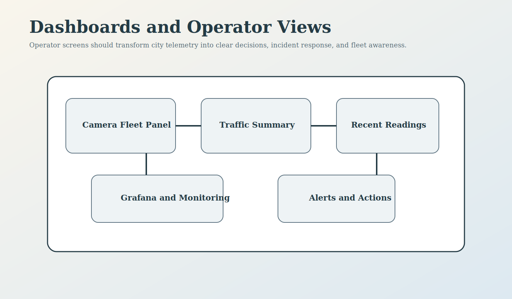
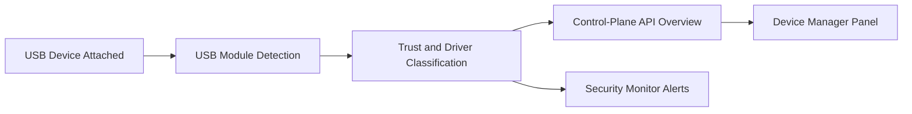
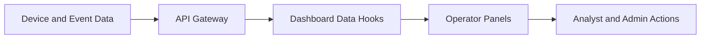

<!--
================================================================================
 File: docs/wiki/DASHBOARDS_AND_OPERATOR_VIEWS.md
 Purpose:
   Dedicated wiki page for SmartCito dashboards, panels, operator workflows,
   and visual monitoring surfaces.
================================================================================
-->

# Dashboards and Operator Views

<p align="center">
  
</p>

## What This Module Does

This area explains the operator-facing web experience: dashboard panels,
camera fleet views, recent readings, traffic summaries, and the control-plane
modules for device management, security posture, data flow, and operator
actions.

## Why It Is Important

The platform only becomes operationally useful when raw telemetry becomes
readable, actionable, and trustworthy for human operators.

## How It Connects To Other Modules

- consumes API and event data,
- exposes security and fleet state to operators,
- visualizes device health and traffic conditions,
- supports hardware-backed operational decisions.

## Security Measures Applied

- dashboard access follows API auth and RBAC,
- operator data is sourced through controlled endpoints,
- live operational context is bounded by backend policy checks.

## Control-Plane Modules

- Device Manager maps cameras, USB adapters, GPS receivers, and field bridges to trusted driver containers.
- Security Monitor exposes IAM, audit, hybrid encryption, and quantum-safe posture in one place.
- Data Flow View shows how USB, RTSP, MQTT, Kafka, SQL, and dashboard layers connect.
- Operator Controls allow controlled start or stop actions for service and policy domains.

## USB Plug-In Workflow



## View Flow



## Related Surfaces

- [../../webapp/src/pages/Dashboard.tsx](../../webapp/src/pages/Dashboard.tsx)
- [../../webapp/src/components/RegisteredCamerasPanel.tsx](../../webapp/src/components/RegisteredCamerasPanel.tsx)
- [../../webapp/src/components/DeviceManagerPanel.tsx](../../webapp/src/components/DeviceManagerPanel.tsx)
- [../../webapp/src/components/SecurityMonitorPanel.tsx](../../webapp/src/components/SecurityMonitorPanel.tsx)
- [../../webapp/src/components/DataFlowViewPanel.tsx](../../webapp/src/components/DataFlowViewPanel.tsx)
- [../../webapp/src/components/OperatorControlsPanel.tsx](../../webapp/src/components/OperatorControlsPanel.tsx)
- [../../webapp/src/components/TrafficSummaryPanel.tsx](../../webapp/src/components/TrafficSummaryPanel.tsx)
- [../../webapp/src/components/RecentReadingsPanel.tsx](../../webapp/src/components/RecentReadingsPanel.tsx)
- [../../webapp/src/api/controlPlane.ts](../../webapp/src/api/controlPlane.ts)

## Container Run Instructions

```bash
docker compose up --build webapp
open http://localhost:5173
```

## Visual Design Note

As real screenshots or exports become available, this page should be updated
with images of the dashboard, Grafana panels, and operator alert states.