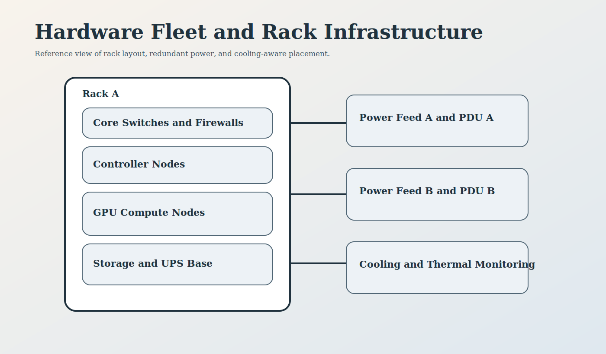
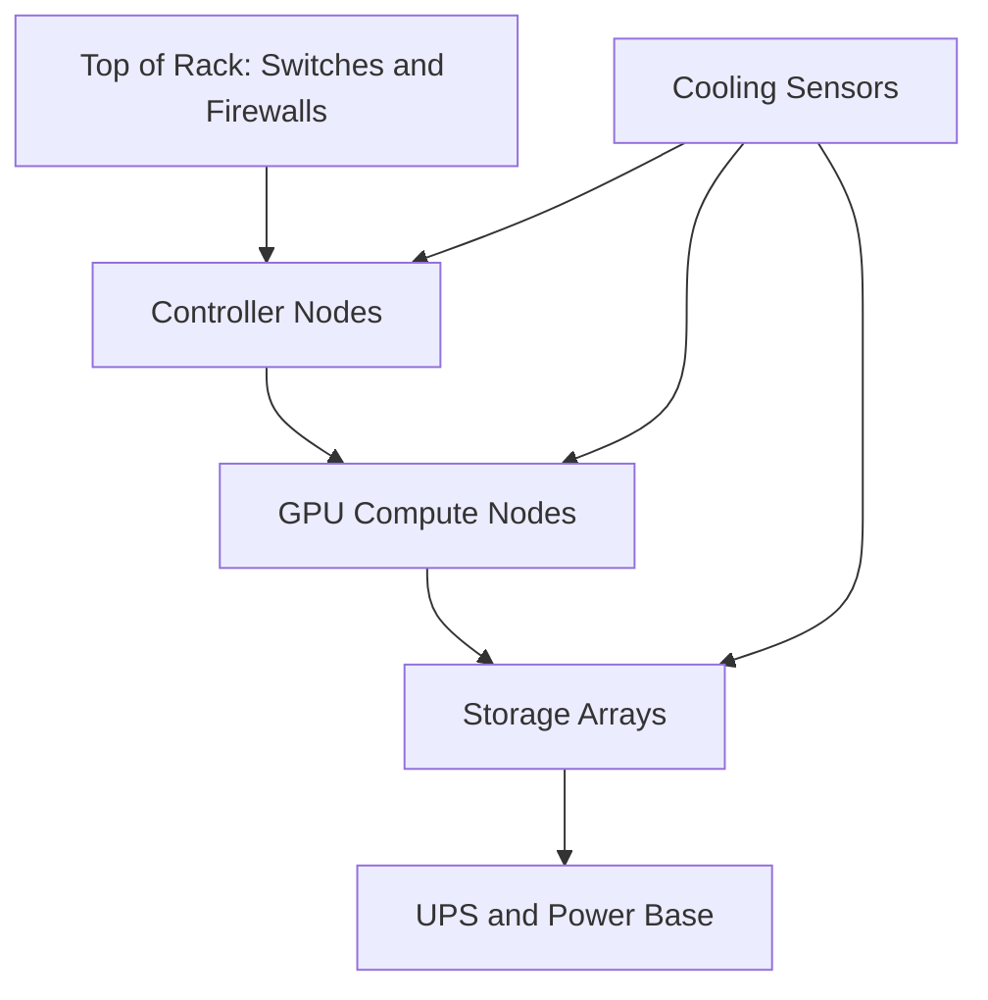
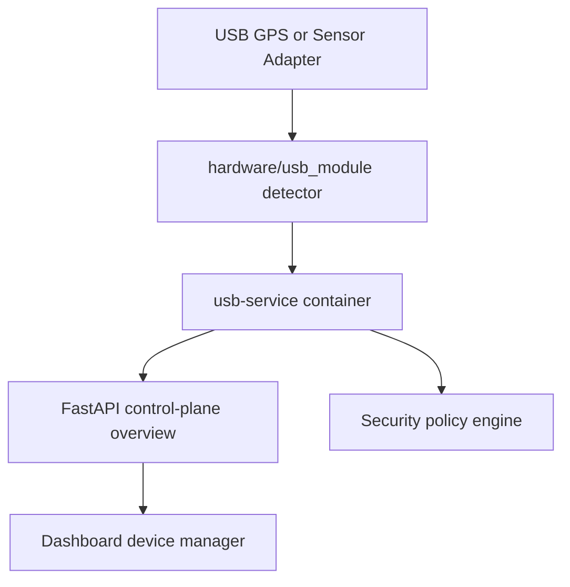

<!--
================================================================================
 File: docs/wiki/HARDWARE_FLEET_AND_RACK_INFRASTRUCTURE.md
 Purpose:
   Dedicated wiki page for hardware topology, racks, power, cooling, and CI
   validation of SmartCito infrastructure.
================================================================================
-->

# Hardware Fleet and Rack Infrastructure

<p align="center">
  
</p>

## What This Module Does

This area documents the physical deployment model behind SmartCito: controller
nodes, compute servers, storage tiers, network edges, racks, PDUs, UPS units,
and monitoring points.

## Why It Is Important

SmartCito is intended for real operational environments. The hardware layer
must be clear enough that software, power, cooling, and physical security can
be reasoned about together.

## How It Connects To Other Modules

- compute nodes run analytics and service workloads,
- storage systems back the database and event flows,
- networks carry camera, GPS, and API traffic,
- USB adapters bridge portable field devices into the secured ingest path,
- security appliances protect keys and access,
- CI validates key rack and hardware assumptions.

## Security Measures Applied

- dual-feed power and UPS coverage,
- management network segmentation,
- tamper-aware hardware security modules,
- monitored rack telemetry.

## Rack View



## Related Folders

- [../../hardware/README.md](../../hardware/README.md)
- [../../hardware/usb_module/README.md](../../hardware/usb_module/README.md)
- [../../hardware/compute/README.md](../../hardware/compute/README.md)
- [../../hardware/storage/README.md](../../hardware/storage/README.md)
- [../../hardware/networking/README.md](../../hardware/networking/README.md)
- [../../hardware/security/README.md](../../hardware/security/README.md)
- [../../hardware/racks/README.md](../../hardware/racks/README.md)

## Validation Scripts

- [../../hardware/compute/test_compute_nodes.py](../../hardware/compute/test_compute_nodes.py)
- [../../hardware/storage/test_storage_arrays.py](../../hardware/storage/test_storage_arrays.py)
- [../../hardware/networking/test_network_transmission.py](../../hardware/networking/test_network_transmission.py)
- [../../hardware/security/test_hsm_integrity.py](../../hardware/security/test_hsm_integrity.py)
- [../../hardware/racks/test_power_distribution.py](../../hardware/racks/test_power_distribution.py)

## Container and Runtime Context

```bash
docker compose -f docker-compose.yml -f docker-compose.hardware.yml up --build
pytest hardware/compute/test_compute_nodes.py hardware/racks/test_power_distribution.py -q
```

## USB Driver Mapping Flow

