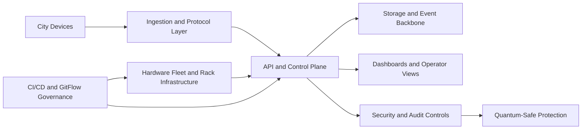

<!--
================================================================================
 File: docs/wiki/Home.md
 Purpose:
   GitHub Wiki-ready home page for SmartCito. This is the visual landing page
   for the wiki UI and the entry point for contributors, operators, and
   stakeholders.
================================================================================
-->

# SmartCito Wiki Home

  

SmartCito is building a secure urban operations backbone that connects cameras,
GPS streams, IoT sensors, APIs, storage, dashboards, hardware infrastructure,
and quantum-ready security controls into one governed platform.

This wiki is designed to show, clearly and visually:

- what each module does,
- why it matters,
- how it connects to the rest of the platform,
- what security measures protect it,
- how contributors and operators should work with it.

## What We Want To Achieve

SmartCito is intended to become a platform where city systems are not trapped in
isolated vendor silos. Instead, devices, events, control-plane APIs, dashboards,
hardware infrastructure, and security policy all work together as one auditable,
scalable system.

## Quick Navigation

| Area | Page |
|---|---|
| Governance and CI/CD | [CI_CD_AND_GITFLOW_GOVERNANCE](CI_CD_AND_GITFLOW_GOVERNANCE) |
| Hardware fleet and racks | [HARDWARE_FLEET_AND_RACK_INFRASTRUCTURE](HARDWARE_FLEET_AND_RACK_INFRASTRUCTURE) |
| API and control plane | [SMARTEDGE_API_AND_CONTROL_PLANE](SMARTEDGE_API_AND_CONTROL_PLANE) |
| Security and audit | [SECURITY_AND_AUDIT_CONTROLS](SECURITY_AND_AUDIT_CONTROLS) |
| Dashboards and operator UX | [DASHBOARDS_AND_OPERATOR_VIEWS](DASHBOARDS_AND_OPERATOR_VIEWS) |
| Map integration | [SMARTCITO_MAP_INTEGRATION](SMARTCITO_MAP_INTEGRATION) |
| 3D dashboard | [SMARTCITO_3D_DASHBOARD](SMARTCITO_3D_DASHBOARD) |
| Storage and event backbone | [STORAGE_AND_EVENT_BACKBONE](STORAGE_AND_EVENT_BACKBONE) |
| Ingestion and protocol adapters | [INGESTION_AND_PROTOCOL_ADAPTERS](INGESTION_AND_PROTOCOL_ADAPTERS) |
| City devices and systems | [CITY_DEVICES_AND_SYSTEMS](CITY_DEVICES_AND_SYSTEMS) |
| Quantum-safe envelope | [QUANTUM_SAFE_ENVELOPE_AND_OID_WRAPPERS](QUANTUM_SAFE_ENVELOPE_AND_OID_WRAPPERS) |
| Roadmap | [ROADMAP_AND_DELIVERY_TIMELINE](ROADMAP_AND_DELIVERY_TIMELINE) |

## Visual Journey

## Suggested Reading Paths

### For developers

1. [SMARTEDGE_API_AND_CONTROL_PLANE](SMARTEDGE_API_AND_CONTROL_PLANE)
2. [INGESTION_AND_PROTOCOL_ADAPTERS](INGESTION_AND_PROTOCOL_ADAPTERS)
3. [STORAGE_AND_EVENT_BACKBONE](STORAGE_AND_EVENT_BACKBONE)
4. [CI_CD_AND_GITFLOW_GOVERNANCE](CI_CD_AND_GITFLOW_GOVERNANCE)

### For operators and infrastructure teams

1. [HARDWARE_FLEET_AND_RACK_INFRASTRUCTURE](HARDWARE_FLEET_AND_RACK_INFRASTRUCTURE)
2. [DASHBOARDS_AND_OPERATOR_VIEWS](DASHBOARDS_AND_OPERATOR_VIEWS)
3. [SECURITY_AND_AUDIT_CONTROLS](SECURITY_AND_AUDIT_CONTROLS)
4. [ROADMAP_AND_DELIVERY_TIMELINE](ROADMAP_AND_DELIVERY_TIMELINE)

### For security and audit reviewers

1. [SECURITY_AND_AUDIT_CONTROLS](SECURITY_AND_AUDIT_CONTROLS)
2. [QUANTUM_SAFE_ENVELOPE_AND_OID_WRAPPERS](QUANTUM_SAFE_ENVELOPE_AND_OID_WRAPPERS)
3. [CI_CD_AND_GITFLOW_GOVERNANCE](CI_CD_AND_GITFLOW_GOVERNANCE)
