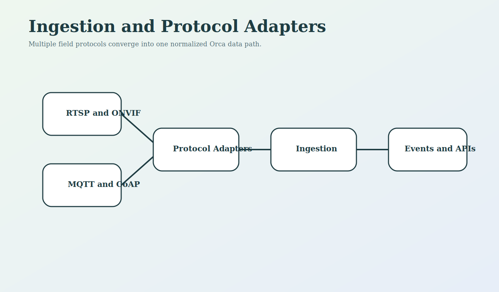
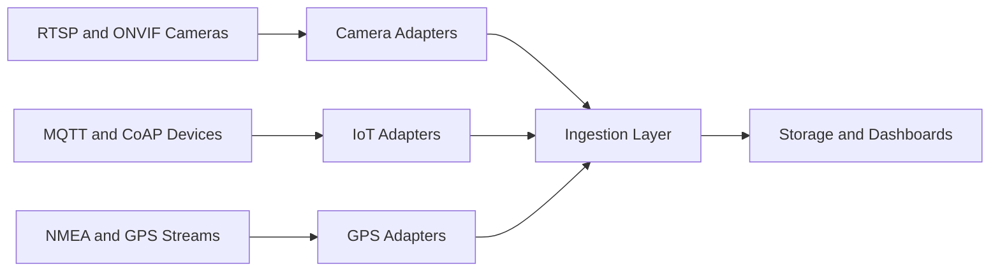

<!--
================================================================================
 File: docs/wiki/INGESTION_AND_PROTOCOL_ADAPTERS.md
 Purpose:
   Dedicated wiki page for protocol adapters, data ingress, and normalization
   across cameras, GPS, and IoT devices.
================================================================================
-->

# Ingestion and Protocol Adapters

<p align="center">
  
</p>

## What This Module Does

This area explains how SmartCito receives data from heterogeneous devices and
protocols, normalizes them, and moves them into durable service boundaries.

## Why It Is Important

Cities do not deploy one device type or one vendor stack. SmartCito only works
if it can absorb multiple protocols and still produce a coherent operating view.

## How It Connects To Other Modules

- devices and field systems feed into this layer,
- normalized data is pushed into Kafka and APIs,
- storage and dashboards depend on its consistency,
- security controls validate the path end to end.

## Security Measures Applied

- controlled transport boundaries,
- protocol-aware validation,
- secure handoff into the API and event layers,
- hardware validation support for live endpoints.

## Protocol Map



## Related Surfaces

- [../../camera_module/README.md](../../camera_module/README.md)
- [../../gps_module/README.md](../../gps_module/README.md)
- [../../ingestion/README.md](../../ingestion/README.md)
- [../../camera_module/drivers/onvif_driver.py](../../camera_module/drivers/onvif_driver.py)
- [../../camera_module/drivers/rtsp_driver.py](../../camera_module/drivers/rtsp_driver.py)

## Container Run Instructions

```bash
docker compose up --build camera-service gps-service
curl http://localhost:8010/drivers
curl http://localhost:8011/standards
```