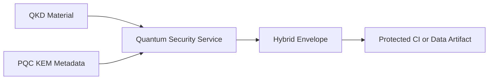

<!--
================================================================================
 File: docs/wiki/QUANTUM_SAFE_ENVELOPE_AND_OID_WRAPPERS.md
 Purpose:
   Dedicated wiki page for SmartCito's quantum-safe migration layer, including
   hybrid envelopes, PQC tracking, and QKD readiness.
================================================================================
-->

# Quantum-Safe Envelope and OID Wrappers

<p align="center">
  
</p>

## What This Module Does

This area documents the quantum-ready abstraction layer in SmartCito, including
hybrid encryption envelopes, tracked PQC algorithm families, and imported QKD
material used for future-ready security integration.

## Why It Is Important

SmartCito is designed for long-lived infrastructure. That means crypto agility
must be planned now instead of postponed until later migrations become costly.

## How It Connects To Other Modules

- secures CI audit artifacts,
- supports future hardware and network crypto upgrades,
- integrates with security services and compliance controls,
- provides a stable contract before mature PQC hardware is fully deployed.

## Security Measures Applied

- AES-256-GCM hybrid envelopes,
- HKDF-based key derivation,
- tracked PQC KEM identifiers,
- QKD key import support,
- explicit crypto metadata for traceability.

## Quantum Flow



## Related Surfaces

- [../../citosmart/app/services/quantum_security.py](../../citosmart/app/services/quantum_security.py)
- [../../citosmart/app/schemas/quantum.py](../../citosmart/app/schemas/quantum.py)
- [../../citosmart/app/api/v1/endpoints/quantum.py](../../citosmart/app/api/v1/endpoints/quantum.py)
- [../../scripts/ci/quantum_protect_audit.py](../../scripts/ci/quantum_protect_audit.py)

## Container and Usage Instructions

```bash
docker compose up --build citosmart security-service
python3 scripts/ci/quantum_protect_audit.py logs/ci_audit.json logs/ci_audit.local.quantum.json
```