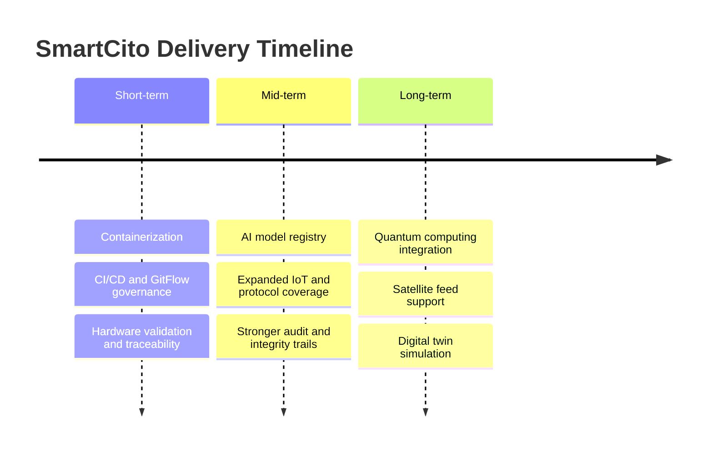

<!--
================================================================================
 File: docs/wiki/ROADMAP_AND_DELIVERY_TIMELINE.md
 Purpose:
   Dedicated wiki page for SmartCito's delivery roadmap across short-, mid-,
   and long-term platform goals.
================================================================================
-->

# Roadmap and Delivery Timeline

  

## What This Page Does

This page turns SmartCito's roadmap into a clear visual sequence so developers,
designers, operators, and stakeholders can see what the platform is trying to
achieve over time.

## Why It Is Important

Without a visible delivery story, the platform can feel like disconnected
modules. The roadmap shows how containerization, hardware validation, AI,
security, and quantum-safe goals fit together.

## How It Connects To Other Modules

- short-term work stabilizes services and CI,
- mid-term work expands AI, audit, and device reach,
- long-term work connects quantum, satellite, and digital-twin ambitions.

## Security Measures Applied

- every phase carries security and audit expectations,
- later phases extend, not replace, existing governance.

## Visual Timeline

## Phase Summary

### Short-Term

- containerize major service domains,
- enforce CI/CD and traceability,
- validate hardware-related flows in simulation and controlled live modes.

### Mid-Term

- establish an AI model registry and cleaner inference lifecycle,
- broaden IoT expansion and protocol coverage,
- deepen tamper-evident or blockchain-backed audit research if justified.

### Long-Term

- mature quantum-safe deployment patterns,
- support satellite and off-grid data links,
- connect SmartCito into digital twin simulation environments.

## Related Pages

- [../ROADMAP.md](../ROADMAP.md)
- [CI_CD_AND_GITFLOW_GOVERNANCE.md](CI_CD_AND_GITFLOW_GOVERNANCE.md)
- [HARDWARE_FLEET_AND_RACK_INFRASTRUCTURE.md](HARDWARE_FLEET_AND_RACK_INFRASTRUCTURE.md)
- [QUANTUM_SAFE_ENVELOPE_AND_OID_WRAPPERS.md](QUANTUM_SAFE_ENVELOPE_AND_OID_WRAPPERS.md)