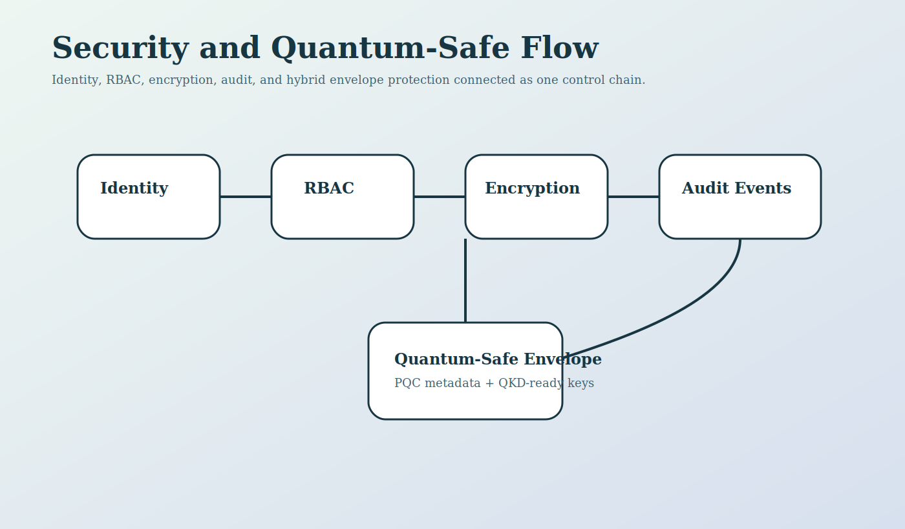
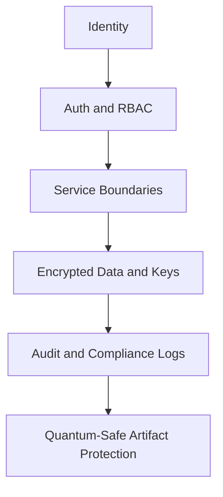

<!--
================================================================================
 File: docs/wiki/SECURITY_AND_AUDIT_CONTROLS.md
 Purpose:
   Dedicated wiki page for SmartCito's encryption, IAM, compliance, audit, and
   quantum-safe security posture.
================================================================================
-->

# Security and Audit Controls

<p align="center">
  
</p>

## What This Module Does

This area documents the controls that protect SmartCito identities, services,
data flows, storage, and audit artifacts.

## Why It Is Important

SmartCito is intended for critical urban environments where weak security would
turn operational convenience into public risk.

## How It Connects To Other Modules

- protects API access,
- protects stored data and keys,
- protects CI artifacts and traceability,
- aligns hardware security with software controls.

## Security Measures Applied

- JWT and RBAC,
- AES-256-GCM encryption,
- audit logs and security policies,
- HSM and tamper-aware hardware controls,
- hybrid PQC and QKD-ready envelope support.

## Security Layers



## Related Surfaces

- [../SECURITY_DEEP_DIVE.md](../SECURITY_DEEP_DIVE.md)
- [../../SECURITY.md](../../SECURITY.md)
- [../../security/README.md](../../security/README.md)
- [../../citosmart/app/core/security.py](../../citosmart/app/core/security.py)
- [../../citosmart/app/core/crypto.py](../../citosmart/app/core/crypto.py)
- [../../scripts/ci/record_ci_audit.py](../../scripts/ci/record_ci_audit.py)
- [../../scripts/ci/quantum_protect_audit.py](../../scripts/ci/quantum_protect_audit.py)

## Container Run Instructions

```bash
docker compose up --build security-service
curl -X POST http://localhost:8013/encrypt -H 'Content-Type: application/json' -d '{"plaintext":"hello","purpose":"demo"}'
```