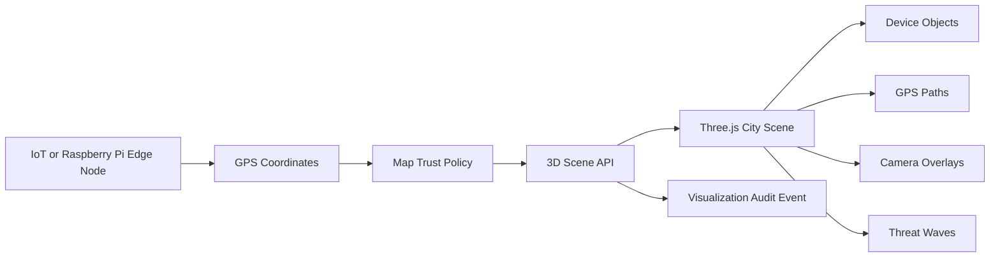

<!--
================================================================================
 File: docs/wiki/SMARTCITO_3D_DASHBOARD.md
 Purpose:
   GitHub Wiki-ready page for the SmartCito Three.js 3D dashboard control plane.
================================================================================
-->

# SmartCito 3D Dashboard

The SmartCito 3D dashboard turns verified IoT devices, Raspberry Pi edge nodes,
GPS paths, camera objects, and AI threat waves into an interactive city scene.
It uses Three.js in the React dashboard and consumes 3D-ready data from the
control-plane API.

## Implemented Flow



## API Surface

```text
GET /api/v1/control-plane/scene
```

The endpoint returns:

- 3D coordinates for verified devices,
- trust score and status color,
- camera feed URLs for camera-capable objects,
- GPS path coordinates,
- AI threat wave metadata,
- security policy text for the visualization layer.

## Dashboard Features

- 3D city grid with building blocks and lighting.
- Device objects positioned from GPS coordinates.
- Trust color mapping: green verified, yellow unverified, red blocked.
- Camera-capable devices rendered as camera-style objects.
- GPS paths rendered as 3D lines.
- Threat waves rendered as animated rings.
- Operator layer toggles for IoT, GPS paths, camera overlays, and threats.
- Clickable 3D markers select device metadata in the side rail.

## Security Rules

- Scene API requires a viewer JWT through the existing RBAC dependency.
- Devices are inherited from the verified map policy before appearing in 3D.
- Every scene request records a `control-plane.scene.visualized` audit event.
- Threat waves and camera overlays are derived from authorized control-plane
  data, not unauthenticated browser state.

## Implementation Files

| Surface | File |
|---|---|
| Scene schemas | [../../citosmart/app/schemas/control_plane.py](../../citosmart/app/schemas/control_plane.py) |
| Scene aggregation | [../../citosmart/app/services/control_plane.py](../../citosmart/app/services/control_plane.py) |
| Scene endpoint | [../../citosmart/app/api/v1/endpoints/control_plane.py](../../citosmart/app/api/v1/endpoints/control_plane.py) |
| Frontend scene client | [../../webapp/src/api/scene.ts](../../webapp/src/api/scene.ts) |
| Three.js component | [../../webapp/src/components/ThreeDashboardPanel.tsx](../../webapp/src/components/ThreeDashboardPanel.tsx) |
| Dashboard wiring | [../../webapp/src/pages/Dashboard.tsx](../../webapp/src/pages/Dashboard.tsx) |

## Validation

```bash
cd citosmart
.venv/bin/pytest tests/test_map_integration.py -q

cd ../webapp
npm test -- Dashboard.test.tsx
npm run build
```

Browser validation confirms the WebGL canvas is nonblank and lists verified
demo devices when the backend API is unavailable.