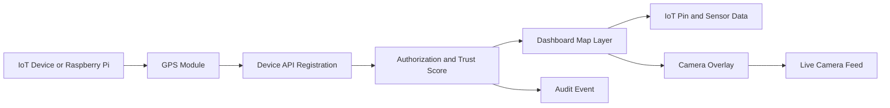

<!--
================================================================================
 File: docs/wiki/SMARTCITO_MAP_INTEGRATION.md
 Purpose:
   GitHub Wiki-ready page for SmartCito IoT, GPS, map, Raspberry Pi, and
   camera overlay integration.
================================================================================
-->

# SmartCito Map Integration

SmartCito map integration connects IoT devices, GPS metadata, verified trust
scores, sensor data, and camera feeds into one operator map. Raspberry Pi edge
nodes, USB plug-ins, cameras, and GPS modules become first-class map citizens
only after they authenticate through the Device API and pass the trust policy.

## IoT To GPS To Map To Camera Flow



## Implemented Surfaces

| Surface | Implementation |
|---|---|
| Map API overview | [../../citosmart/app/api/v1/endpoints/control_plane.py](../../citosmart/app/api/v1/endpoints/control_plane.py) |
| Map aggregation and trust policy | [../../citosmart/app/services/control_plane.py](../../citosmart/app/services/control_plane.py) |
| Map schemas | [../../citosmart/app/schemas/control_plane.py](../../citosmart/app/schemas/control_plane.py) |
| Dashboard map client | [../../webapp/src/api/map.ts](../../webapp/src/api/map.ts) |
| Leaflet map panel | [../../webapp/src/components/SmartMapPanel.tsx](../../webapp/src/components/SmartMapPanel.tsx) |
| Dashboard composition | [../../webapp/src/pages/Dashboard.tsx](../../webapp/src/pages/Dashboard.tsx) |

## API Endpoints

```text
GET  /api/v1/control-plane/map
POST /api/v1/control-plane/map/register
```

The map overview returns only verified devices with `trust_score > 80`. Camera
devices expose camera feed URLs, IoT devices expose sensor values, and GPS paths
are returned as coordinate sequences for dashboard tracking.

## Raspberry Pi Registration Example

```python
import requests

token = "<operator-jwt>"
payload = {
    "device_id": "raspi-mobile-002",
    "device_type": "iot",
    "name": "Raspberry Pi Mobile Sensor",
    "latitude": -25.741,
    "longitude": 28.218,
    "trust_score": 91,
    "camera_feed_url": "rtsp://edge/raspi-mobile-002/camera",
    "sensor_type": "traffic-density",
    "sensor_value": 0.82,
    "mqtt_topic": "smartcito/pi/raspi-mobile-002/events",
}

response = requests.post(
    "http://localhost:8000/api/v1/control-plane/map/register",
    json=payload,
    headers={"Authorization": f"Bearer {token}"},
    timeout=10,
)
response.raise_for_status()
print(response.json())
```

## Dashboard Features

- Device pins show verified IoT, GPS, USB, and camera devices.
- Camera overlays link map pins to RTSP camera feed URLs.
- GPS paths show recent movement for mobile edge nodes.
- Sensor heatmap circles visualize sensor intensity near device coordinates.
- Layer toggles let operators enable or disable pins, camera overlays, paths,
  and heatmap views.

## Security Notes

- Device registration requires an operator JWT.
- Map overview requires a viewer JWT.
- Devices must have `trust_score > 80` before they appear on the dashboard map.
- GPS and event transport should use TLS and SmartCito's quantum-ready envelope
  service for sensitive payloads.
- Registration writes an audit event with device type, trust score, MQTT topic,
  and whether the device is visible on the map.

## Screenshot Guidance

Run the dashboard locally and open the map panel:

```bash
cd webapp
npm run dev -- --host 0.0.0.0
open http://localhost:5174/dashboard
```

The panel titled `SmartCito Map Integration` shows the live Leaflet map with
verified device pins, camera overlays, GPS paths, and sensor heatmap layers.