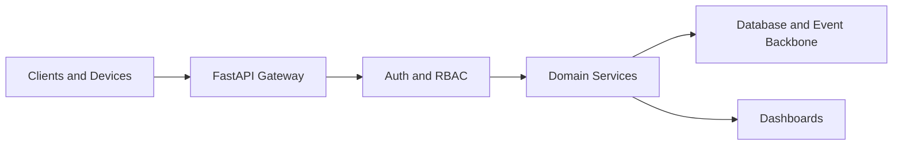

<!--
================================================================================
 File: docs/wiki/SMARTEDGE_API_AND_CONTROL_PLANE.md
 Purpose:
   Dedicated wiki page for the SmartCito API gateway, orchestration logic, and
   control-plane responsibilities.
================================================================================
-->

# SmartEdge API and Control Plane

<p align="center">
  
</p>

## What This Module Does

The SmartCito control plane exposes APIs, orchestrates secure access, mediates
device registration, and provides the central operational surface for services
and dashboards.

## Why It Is Important

This is the platform boundary where operators, devices, and services meet.
It is the main place where trust, validation, and business logic converge.

## How It Connects To Other Modules

- receives ingestion and registration requests,
- reads and writes storage-backed domain data,
- feeds dashboards and telemetry views,
- emits audit and security events,
- fronts quantum-ready and hardware-aware services.

## Security Measures Applied

- JWT authentication,
- RBAC authorization,
- input validation,
- audit-friendly control-plane operations.

## API Flow



## Key Surfaces

- [../../citosmart/app/main.py](../../citosmart/app/main.py)
- [../../citosmart/app/api/v1/router.py](../../citosmart/app/api/v1/router.py)
- [../../citosmart/app/api/v1/endpoints](../../citosmart/app/api/v1/endpoints)
- [../API.md](../API.md)

## Container Run Instructions

```bash
docker compose up --build citosmart
curl http://localhost:8000/api/v1/health/live
```