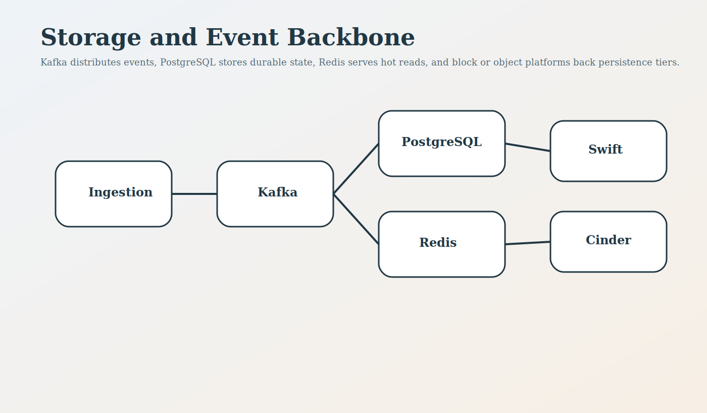
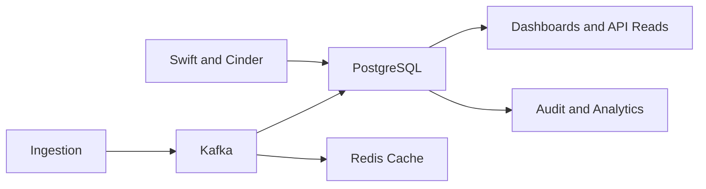

<!--
================================================================================
 File: docs/wiki/STORAGE_AND_EVENT_BACKBONE.md
 Purpose:
   Dedicated wiki page for databases, Kafka, object storage, block storage,
   and event durability in SmartCito.
================================================================================
-->

# Storage and Event Backbone

<p align="center">
  
</p>

## What This Module Does

This area describes how SmartCito stores relational data, streams events,
buffers hot reads, and maps block or object storage into operational flows.

## Why It Is Important

Storage is the durability layer of the platform. If this design is weak,
device data, audit events, and operational state become unreliable.

## How It Connects To Other Modules

- ingestion writes into the event backbone,
- APIs read durable state from the database,
- dashboards depend on low-latency storage and cache,
- infra maps these services onto block and object backends.

## Security Measures Applied

- encrypted storage baselines,
- audit-aware event persistence,
- tiered retention and access boundaries,
- separation between hot ingest and long-term archives.

## Data Backbone Flow



## Related Surfaces

- [../../database/README.md](../../database/README.md)
- [../../ingestion/README.md](../../ingestion/README.md)
- [../../citosmart/app/db/models.py](../../citosmart/app/db/models.py)
- [../../infra/terraform/README.md](../../infra/terraform/README.md)

## Container Run Instructions

```bash
docker compose up --build postgres kafka redis
python database/bootstrap.py
```